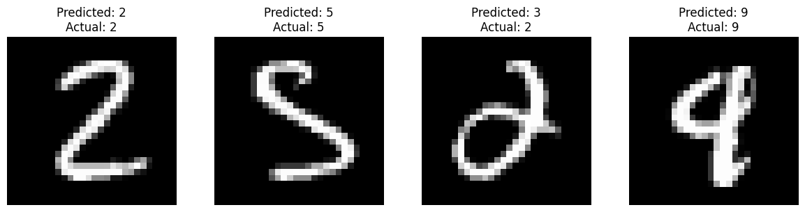

# Handwritten Digit Recognition using Neural Networks

## 📝 Table of Contents

1. [ Project Overview ](#Overview)
2. [ Problem Statement ](#Statement)
3. [ Dataset ](#Dataset)
4. [ Models ](#Models)
5. [ Model Comparison and Analysis ](#Comparison)
6. [ Displaying Images with Predictions ](#Predictions)
7. [ Understanding Activation Functions: Sigmoid, Softmax, and ReLU ](#Functions)
8. [ Usage ](#Usage)

## Overview
This project aims to develop and compare three different neural network models for handwritten digit recognition. Handwritten digit recognition is a classic problem in the field of machine learning and computer vision, with applications in various domains such as postal automation, bank check processing, and digitized document handling.

## Problem Statement
The task is to classify grayscale images of handwritten digits (0 through 9) into their respective categories. Given an image of a handwritten digit, the model should predict the correct digit label.

## Dataset
The dataset used for this project is the MNIST dataset, one of the most commonly used datasets in the machine learning community. It consists of 60,000 training images and 10,000 test images of handwritten digits, each image being a grayscale 28x28 pixel matrix.

## Models
### Model 1: Simple Neural Network
##### `Architecture:`
- One hidden layer with 10 neurons and a softmax output layer.
##### `Layers:`
- Dense layer with 10 neurons and softmax activation.
##### `Training:`
- Stochastic Gradient Descent (SGD) optimizer.
#### Model 2: Neural Network with Increased Complexity
##### `Architecture:`
- One hidden layer with 100 neurons and a softmax output layer.
##### `Layers:`
- Dense layer with 100 neurons and sigmoid activation.
- Dense layer with 10 neurons and softmax activation.
##### `Training:`
- Stochastic Gradient Descent (SGD) optimizer.
#### Model 3: Convolutional Neural Network (CNN)
##### `Architecture:`
- Convolutional layers followed by max-pooling layers to extract features.
- Flattening layer followed by dense layers for classification.
##### `Layers:`

- Convolutional layers:
  - First Conv2D layer with 16 filters, kernel size (5,5), and ReLU activation.
  - Second Conv2D layer with 32 filters, kernel size (5,5), and ReLU activation.
  - Third Conv2D layer with 64 filters, kernel size (5,5), and ReLU activation.
- Dense layers:
  - Dense layer with 100 neurons and sigmoid activation.
  - Dense layer with 10 neurons and softmax activation.
##### `Training:`
- Stochastic Gradient Descent (SGD) optimizer.

## Model Comparison and Analysis

Let's compare the three models based on their loss and compile metrics:

1. **Model 1:**
   - Loss: 27.53
   - Compile Metrics: 92.29

2. **Model 2:**
   - Loss: 17.91
   - Compile Metrics: 94.97

3. **Model 3:**
   - Loss: 2.96
   - Compile Metrics: 98.99

Now, let's analyze why the second model is better than the first one and why the third one is the best:

**Comparison between Model 1 and Model 2:**

- **Loss:** Model 2 has a lower loss (17.91) compared to Model 1 (27.53). A lower loss indicates that the model's predictions are closer to the actual values, implying better performance.
  
- **Compile Metrics (Accuracy):** Model 2 has a higher compile metric (accuracy) of 94.97 compared to Model 1 (92.29). This means that Model 2 has a higher accuracy in predicting the correct labels for the test data.

**Explanation:**
Model 2 outperforms Model 1 because it has more complex architecture with an additional hidden layer of 100 neurons. The increased complexity allows the model to learn more intricate patterns and relationships in the data, leading to better performance in terms of accuracy and loss reduction.

**Comparison between Model 2 and Model 3:**

- **Loss:** Model 3 has the lowest loss (2.96) among all models, indicating the best performance in terms of minimizing prediction errors.

- **Compile Metrics (Accuracy):** Model 3 has the highest compile metric (accuracy) of 98.99, which implies that it achieves the highest accuracy in predicting the correct labels for the test data.

**Explanation:**
Model 3, being a convolutional neural network (CNN), is specifically designed for image data. It leverages convolutional and pooling layers to extract hierarchical features from the images, allowing it to capture intricate patterns present in the data. This architecture is well-suited for image classification tasks, resulting in superior performance compared to the other models.

**In summary, the superior performance of Model 2 over Model 1 is attributed to its increased complexity with an additional hidden layer, while the outstanding performance of Model 3 is due to its specialized architecture tailored for image data, which effectively captures relevant features for classification.**

## Displaying Images with Predictions:
The displayed images with predictions showcase the performance of each model in predicting handwritten digits. Specifically, the indices `[2475, 3968, 3811, 359]` were selected due to the challenging nature of the digits they represent, leading to mispredictions by the first model.

- **Model 1**:
  - All four images were incorrectly predicted by Model 1.

- **Model 2**: In comparison, Model 2 showed improved performance:
  - Only one of the selected images (index 2475) was mispredicted, while the remaining three were correctly classified.
    

- **Model 3**: The convolutional model (Model 3) demonstrated the highest accuracy:
  - All four selected images were accurately classified, indicating robust performance even on challenging digit samples.

`These results highlight the effectiveness of the models, with Model 3, the convolutional neural network, exhibiting the most reliable predictions, particularly on complex digit representations.`

## Understanding Activation Functions: Sigmoid, Softmax, and ReLU
- Sigmoid Activation Function:
  - The sigmoid function, also known as the logistic function, is a type of activation function used in neural networks.
  - It squashes the input values between 0 and 1, making it suitable for binary classification problems.
  - Mathematically, the sigmoid function is defined as:
  - the sigmoid activation function is applied to the output of the hidden layer with 100 neurons. This introduces non-linearity into the network, allowing it to learn complex patterns in the data.
    
`Why Sigmoid`:

Sigmoid activation is chosen for the hidden layer to introduce non-linearity and capture complex patterns in the data, especially when dealing with features that may have non-linear relationships.
 

- Softmax Activation Function:
  - Softmax is another type of activation function commonly used in the output layer of classification models, especially when dealing with multi-class classification problems.
  - It transforms the raw output scores into probabilities by exponentiating each score and normalizing the results.
  - The softmax function is defined as:
  - Softmax ensures that the sum of the probabilities for all classes equals 1, making it interpretable as a probability distribution over the classes.
  - the softmax activation function is applied to the output layer with 10 neurons, where each neuron represents a class in the multi-class classification problem.

`Why Softmax`:

Softmax activation in the output layer is suitable for multi-class classification tasks because it provides a probability distribution over the classes, making it easy to interpret the model's predictions and compare the likelihood of each class.

- ReLU Activation Function (Rectified Linear Unit):
  - ReLU is one of the most widely used activation functions in neural networks.
  - It introduces non-linearity by outputting the input directly if it is positive, and zero otherwise.
  - Mathematically, the ReLU function is defined as:
  - ReLU has several advantages, including computational efficiency and the ability to alleviate the vanishing gradient problem.
  - It is particularly effective in deep neural networks and is widely used in convolutional neural networks (CNNs).
  - the ReLU activation function is used in the convolutional layers (Conv2D) to introduce non-linearity after each convolution operation. This helps the model learn complex patterns in the input images.

`Why ReLU`:

ReLU is chosen over other activation functions like sigmoid or tanh because it overcomes the vanishing gradient problem more effectively, allowing for faster convergence during training.

ReLU also helps to sparsely activate neurons, leading to more efficient computation and better generalization.

Additionally, ReLU has a derivative that is either 0 or 1, which simplifies the backpropagation process and reduces the likelihood of the vanishing gradient problem.

## Usage
- Clone the repository to your local machine.
- Install the required dependencies listed in requirements.txt.
- Run the scripts for training and evaluating the models.
- Experiment with different hyperparameters and architectures for further improvement.

## Contact Me 📨

- **LinkedIn:** [Bilal Fatian](https://www.linkedin.com/in/bilal-fatian-806813254/)
- **Gmail:** [fatian.bilal@gmail.com](mailto:fatian.bilal@gmail.com)
