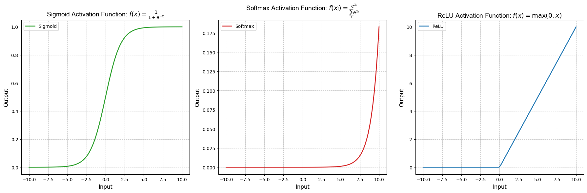

# Handwritten Digit Recognition using Neural Networks
## Overview
This project aims to develop and compare three different neural network models for handwritten digit recognition. Handwritten digit recognition is a classic problem in the field of machine learning and computer vision, with applications in various domains such as postal automation, bank check processing, and digitized document handling.

## Problem Statement
The task is to classify grayscale images of handwritten digits (0 through 9) into their respective categories. Given an image of a handwritten digit, the model should predict the correct digit label.

## Dataset
The dataset used for this project is the MNIST dataset, one of the most commonly used datasets in the machine learning community. It consists of 60,000 training images and 10,000 test images of handwritten digits, each image being a grayscale 28x28 pixel matrix.

## Models
### Model 1: Simple Neural Network
##### `Architecture:`
- One hidden layer with 10 neurons and a softmax output layer.
##### `Layers:`
- Dense layer with 10 neurons and softmax activation.
##### `Training:`
- Stochastic Gradient Descent (SGD) optimizer.
#### Model 2: Neural Network with Increased Complexity
##### `Architecture:`
- One hidden layer with 100 neurons and a softmax output layer.
##### `Layers:`
- Dense layer with 100 neurons and sigmoid activation.
- Dense layer with 10 neurons and softmax activation.
##### `Training:`
- Stochastic Gradient Descent (SGD) optimizer.
#### Model 3: Convolutional Neural Network (CNN)
##### `Architecture:`
- Convolutional layers followed by max-pooling layers to extract features.
- Flattening layer followed by dense layers for classification.
##### `Layers:`

- Convolutional layers:
  - First Conv2D layer with 16 filters, kernel size (5,5), and ReLU activation.
  - Second Conv2D layer with 32 filters, kernel size (5,5), and ReLU activation.
  - Third Conv2D layer with 64 filters, kernel size (5,5), and ReLU activation.
- Dense layers:
  - Dense layer with 100 neurons and sigmoid activation.
  - Dense layer with 10 neurons and softmax activation.
##### `Training:`
- Stochastic Gradient Descent (SGD) optimizer.
- 
## Understanding Activation Functions: Sigmoid, Softmax, and ReLU
- Sigmoid Activation Function:
  - The sigmoid function, also known as the logistic function, is a type of activation function used in neural networks.
  - It squashes the input values between 0 and 1, making it suitable for binary classification problems.
  - Mathematically, the sigmoid function is defined as:
  - the sigmoid activation function is applied to the output of the hidden layer with 100 neurons. This introduces non-linearity into the network, allowing it to learn complex patterns in the data.
    
`Why Sigmoid`:

Sigmoid activation is chosen for the hidden layer to introduce non-linearity and capture complex patterns in the data, especially when dealing with features that may have non-linear relationships.
 

- Softmax Activation Function:
  - Softmax is another type of activation function commonly used in the output layer of classification models, especially when dealing with multi-class classification problems.
  - It transforms the raw output scores into probabilities by exponentiating each score and normalizing the results.
  - The softmax function is defined as:
  - Softmax ensures that the sum of the probabilities for all classes equals 1, making it interpretable as a probability distribution over the classes.
  - the softmax activation function is applied to the output layer with 10 neurons, where each neuron represents a class in the multi-class classification problem.

`Why Softmax`:

Softmax activation in the output layer is suitable for multi-class classification tasks because it provides a probability distribution over the classes, making it easy to interpret the model's predictions and compare the likelihood of each class.

- ReLU Activation Function (Rectified Linear Unit):
  - ReLU is one of the most widely used activation functions in neural networks.
  - It introduces non-linearity by outputting the input directly if it is positive, and zero otherwise.
  - Mathematically, the ReLU function is defined as:
  - ReLU has several advantages, including computational efficiency and the ability to alleviate the vanishing gradient problem.
  - It is particularly effective in deep neural networks and is widely used in convolutional neural networks (CNNs).
  - the ReLU activation function is used in the convolutional layers (Conv2D) to introduce non-linearity after each convolution operation. This helps the model learn complex patterns in the input images.

`Why ReLU`:

ReLU is chosen over other activation functions like sigmoid or tanh because it overcomes the vanishing gradient problem more effectively, allowing for faster convergence during training.

ReLU also helps to sparsely activate neurons, leading to more efficient computation and better generalization.

Additionally, ReLU has a derivative that is either 0 or 1, which simplifies the backpropagation process and reduces the likelihood of the vanishing gradient problem.

## Usage
- Clone the repository to your local machine.
- Install the required dependencies listed in requirements.txt.
- Run the scripts for training and evaluating the models.
- Experiment with different hyperparameters and architectures for further improvement.
